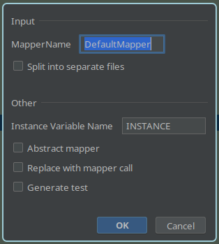

# Mapstructor

This intellij plugin allows you to generate any [MapStruct](https://mapstruct.org/) mapper, just by selecting any amount
of code and executing an action.

## Getting started

1. Get the plugin from the intellij store.
2. Select any text
3. Executor the "MapStructor" Action
4. Select configs
5. Profit

## Features

* Select any code and convert to mapstruct mapper
* Split each mapper into separate files
* Replace selected code with mapper initialization
* Generate interface or abstract class mapper

## Examples

#### Before

    var output = new Output1();
    var output2Nested = new Output2();
    var superNested = new Output3();

    output2Nested.setNested1("1");
    output2Nested.setNested2("1");
    output2Nested.setOuterVariable(a);
    superNested.setSuperNested1("1");
    superNested.setSuperNested2("1");
    superNested.setSuperOuterVariable(b);
    output2Nested.setSuperNestedObject(superNested);
    output.setInput1("test");
    output.setInput5("abc");
    output.setNestedThings(output2Nested);

    return output;

#### After

    @Mapper
    public interface TestMapper {
    
        TestMapper INSTANCE = Mappers.getMapper(TestMapper.class);
        
        @Mapping(target = "superNested1", constant = "1")
        @Mapping(target = "superNested2", constant = "1")
        @Mapping(target = "superOuterVariable", source = "b")
        Output3 mapOutput3(String b);
        
        @Mapping(target = "input1", constant = "test")
        @Mapping(target = "input5", constant = "abc")
        @Mapping(target = "nestedThings", expression = "java(mapOutput2(b, a))")
        Output1 mapOutput1(String b, String a);
        
        @Mapping(target = "nested1", constant = "1")
        @Mapping(target = "nested2", constant = "1")
        @Mapping(target = "outerVariable", source = "a")
        @Mapping(target = "superNestedObject", source = "b")
        Output2 mapOutput2(String b, String a);
    
    }

For more complex examples checkout the test cases.

